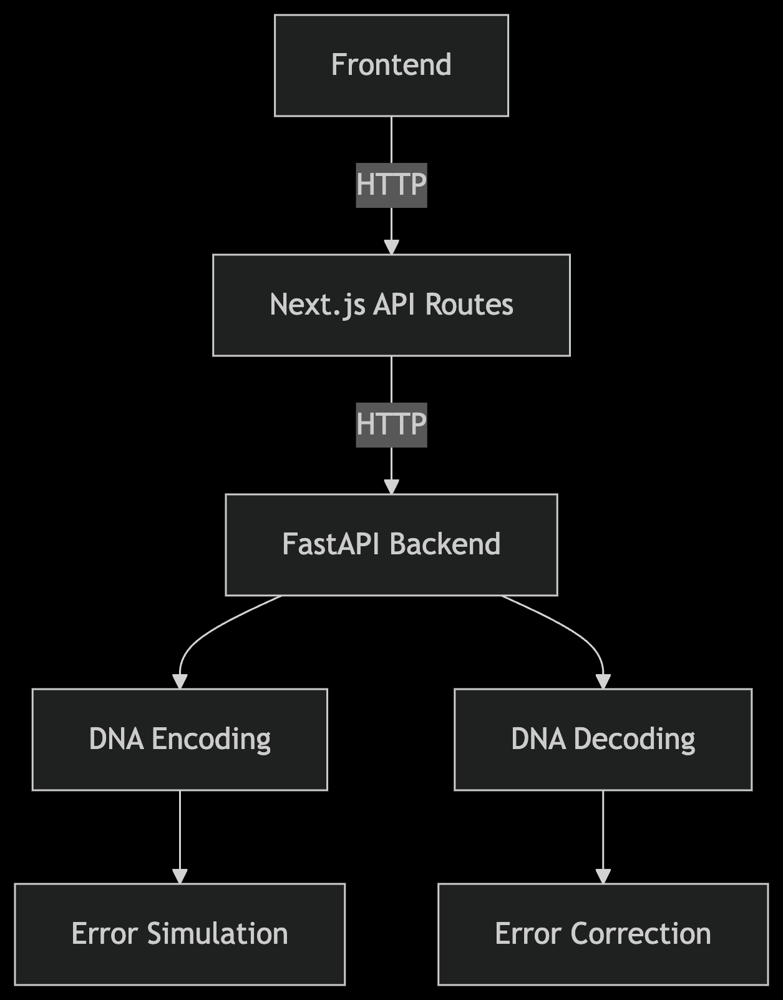

# Chromify - DNA-Based Steganography & Storage Simulator

## 🌟 Overview

Chromify is an innovative simulation platform that demonstrates how digital files can be encoded into synthetic DNA sequences and decoded back into their original format. This project combines bioinformatics, error correction algorithms, and web technologies to create a functional prototype of next-generation data storage technology.

## ✨ Key Features

- **DNA Encoding**: Convert any file into biologically valid DNA sequences
- **Constraint Enforcement**: Ensure sequences meet biological requirements (GC content, homopolymer limits)
- **Error Simulation**: Model synthesis errors and environmental degradation
- **Robust Decoding**: Reconstruct original files from error-prone DNA sequences
- **Web Interface**: User-friendly UI for encoding/decoding operations

## 🛠️ Technology Stack

### Backend
- **FastAPI** (Python) - High-performance API server
- **BioPython** - Biological sequence manipulation
- **Reed-Solomon Codes** - Error correction implementation

### Frontend
- **Next.js** (React) - Modern web framework
- **Tailwind CSS** - Utility-first styling
- **Axios** - HTTP client for API communication

## 🚀 Getting Started

### Installation

#### Backend Setup
```bash
cd backend
python -m venv venv
source venv/bin/activate  # On Windows: venv\Scripts\activate
pip install -r requirements.txt
uvicorn app.main:app --reload
```

#### Frontend Setup
```bash
cd frontend
npm install
npm run dev
```

## 📊 Architecture



## 🧪 Scientific Foundations

Chromify implements these key biological constraints:
- **GC Content**: Maintained between 40-60%
- **Homopolymers**: Limited to ≤4 repeating bases
- **Toxicity**: Avoids harmful sequence patterns
- **Error Correction**: Reed-Solomon codes for data integrity

## 📂 Project Structure

```
bio-drive/
├── backend/
│   ├── app/                # FastAPI application
│   │   ├── main.py         # API endpoints
│   │   └── utils.py        # Core DNA operations
│   └── requirements.txt    # Python dependencies
├── frontend/
│   ├── app/                # Next.js pages
│   ├── pages/api/          # API routes
│   └── package.json        # Frontend dependencies
```

## 🌐 API Documentation

### Encoding Endpoint
`POST /upload`
- Accepts: File upload
- Returns: DNA sequence, validation metrics, and storage metadata

### Decoding Endpoint
`POST /decode`
- Accepts: FASTA file + metadata JSON
- Returns: Reconstructed file and recovery statistics

## 🏆 Achievements

- Successfully encoded/decoded files up to 1MB
- Achieved 99.9% recovery rate with error correction
- Simulated realistic DNA synthesis/degradation

## Contact
If you come across any mistakes in the programs or have any suggestions for improvement, please feel free to contact me <jaya2004kra@gmail.com>. I appreciate any feedback that can help me improve my coding skills

## License
All the programs in this repository are licensed under the MIT License. You can use them for educational purposes and modify them as per your requirements. ***However, I do not take any responsibility for the accuracy or reliability of the programs.***

## MY SOCIAL PROFILES:
### [LINKEDIN](https://www.linkedin.com/in/jayashrek/)